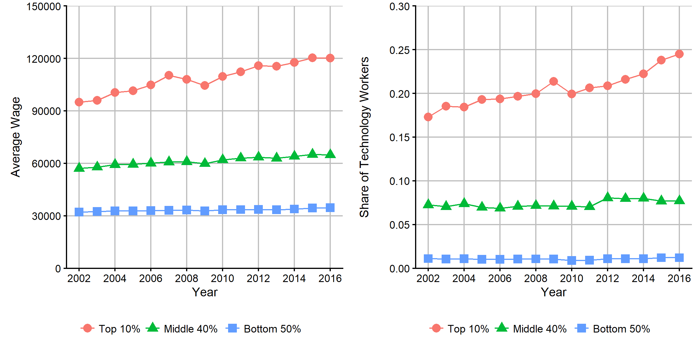

<!-- nocite: |  -->
<!--   @piketty_distributional_2016 -->
```{r setup, include=FALSE, cache = FALSE}
knitr::opts_chunk$set(echo = FALSE, cache = FALSE, warning = FALSE, message = FALSE)

```

\newcommand{\inputtable}[1]{
  \begingroup\setstretch{1.0}
  \input{#1}
  \endgroup
}

\bigskip

\begin{center}
\textbf{ABSTRACT}
\end{center}

\begingroup\setlength{\parindent}{0em}
<!-- \setlength{\leftskip}{4em} -->

\endgroup

\newpage
# Introduction
<!-- (1) motivate your research question,  -->
<!-- (2) clearly state the question,  -->
<!-- (3) briefly outline how you will endeavor to answer the question,  -->
<!-- (4) present your key results, and  -->
<!-- (5) give a roadmap of the rest of the paper -->

<!-- Lit Review -->
<!-- What is known -->
<!-- What types of methods have people used -->

# Data
## Occupational Approach to Identify Technological Advances
This paper uses occupational composition data from the Occupational Employment Statistics (OES) to identify the trends in technological advances at a 4-digit NAICS code level. The OES is based on a semiannual survey, run by the Bureau of Labor Statistics (BLS), which covers about 200,000 establishments per panel. The OES reports employment data by Standard Occupational Classification (SOC)-coded occupation and NAICS-coded industry sector. Datasets are available from 1988, but the first dataset which reports at a 4-digit NAICS code level is the 2002 dataset.

Since technology is an ambiguous concept, this paper uses an occupation-oriented approach to measure the degree of technology use in an industry: the higher the share of technology workers is, the more an industry uses technology. With a given set of technology occupations, this approach produces a continuous measure of technology use which ranges from 0 to 1. Since the degrees to which industries utilize technology greatly differ even among technology industries, this approach has an advantage of being able to compare sectors with high technology use, compared to dichotomous measures used in @hadlock_high_1991 or in @muro_americas_2015.

This paper's approach has a couple of advantages over the approach used in @autor_computing_1998, which used the fraction of workers who directly use a computer keyboard as a measure of the spread of computer technology. First, their measure fails to take account of workers who primarily use sophisticated electronic devices which function without keyboards. Second, more importantly, it might have been true that the majority of keyboard users were technology workers before the 1990s. Nowadays, however, computers and keyboards are an essential part of any workplace, not necessarily technology-related, and many of workers who use keyboards daily are not technology workers.

The effectiveness of the occupation-oriented approach relies on how well technology occupations are defined. This paper uses four criteria, two suggested by @kilcoyne_high-tech_2001 and the other two by the BLS. Table \ref{tab:tab_tech_occ} provides the comprehensive list. The primary criterion identifies high-tech occupations based on the level of technology utilization. High-tech occupations are defined as workers who "typically or necessarily utilize new technologies to perform their duties"[^high-tech-occupations]. These occupations will be referred as "*high-tech* occupations" in this paper. 

Table \ref{tab:tab_top_bottom_tech_ind} lists industry sectors which had the highest and lowest shares of technology workers in 2016. It is easy to see that technology use is heavily concentrated in a few sectors such as Computer Systems Design and Related Services and Software Publishers, which include Microsoft, Intel, and Qualcomm. Even among the top 10 technology sectors, the gap between the first and the tenth amounts to 0.286. On the other hand, in 2016, 19 sectors had zero share of technology workers, including most transportation industries.

[^high-tech-occupations]: @kilcoyne_high-tech_2001

<!-- TABLE: High-tech and low-tech industry sectors -->
<!-- \begingroup\setstretch{1.0} -->
<!-- \input{tex/top_bottom_tech_ind_manual.tex} -->
<!-- \endgroup -->

\inputtable{tex/top_bottom_tech_ind_manual.tex}

To test the robustness, this paper uses three alternative sets of occupations. First, "*technology group* occupations" focuses relatively more on major occupation groups in which the use of technology is prevalent. Instead of specific occupations, this method uses four major occupation groups: Computer and Mathematical Occupations (15-0000), Architecture and Engineering Occupations (17-0000), Life, Physical, and Social Science Occupations (19-0000), Healthcare Practitioners and Technical Occupations (29-0000). Although some of the occupations included in these major groups might not directly make use of high technology, this method is expected to capture potential spillover effects of high-technology workers on other workers whose functions are closely related.

The other two sets of technology occupations are *STEM* and *STEM-related* occupations, as defined by the BLS. 

## Industry-Level Data
To examine the trends in technological advances at the industry level, this paper uses earnings and employment data from the Quarterly Census of Employment and Wages (QCEW), run by the BLS. The QCEW is based on administrative data from the quarterly state unemployment insurance tax records, supplemented by two other BLS surveys, the Annual Refiling Survey and the Multiple Worksite Report. Since the QCEW is census, the data cover more than 95 percent of total employment and are not subject to sampling error. The unit of observation is an establishment, but the publicly available datasets report employment and wage by year and region only at the industry level, using the NAICS from 1990. Wages in the QCEW are defined as total compensation paid, including stock options and bonuses. This paper uses annual wage and employment data at a 4-digit NAICS code level from 2002 to 2016 in the private sector, measured in 2009 dollar.

By linking the measure of technology use constructed from the OES, the QCEW data provide insight on how the wage trends have evolved with technological advances at the industry level. Table \ref{tab:tab_industry_tech_share} illustrates the trends in employment and wage share of technology workers. Wage share was imputed assuming that technology and non-technology workers within a sector receive the same level of wage; since in reality technology workers tend to receive higher wages, actual wage shares of technology workers are expected to be higher.

<!-- TAB: Employment/Wage share of technology workers - from QCEW and OES -->
\begingroup\setstretch{1.0}
\input{tex/industry_tech_share.tex}
\endgroup
<!-- TODO: wage share imputation note  -->

Breaking down industry sectors into the top 10%, middle 40%, and bottom 50% wage groups, one can see the evolution of technology use has not been evenly distrtibuted among sectors. The panels of Figure 1 suggest that the growth in average wage and the share of technology workers has been noticeably different between wage groups. As displayed in Table \ref{tab:tab_industry_trends_by_group}, on average, sectors saw a 14.67% increase in wage, and 1.00 percentage point increase in the share of technology workers. However, the bottom 50% stagnated in terms of technology, while the top 10% had substantially higher growth of 7.21 percentage points. 

<!-- TAB: Industry trends by group -->
\begingroup\setstretch{1.0}
\input{tex/industry_trends_by_group.tex}
\endgroup




## Individual-Level Data
To further analyze the trends in wage and technology at the individual level, this paper uses data from the CPS Annual Social and Economic Supplement during the same period[^IPUMS]. Summary statistics are reported in Table \ref{tab:tab_aces_summary}, and inequality measures are reported in Table \ref{tab:tab_wage_ineq_measures}.

[^IPUMS]: @flood_integrated_2017

As in @dinardo_labor_1996, this paper restricted the sample to individuals of age 16 to 65 and reporting an hourly wage from $1 to $150 (in 2009 dollars). The GDP deflator for personal consumption expenditures was used to convert nominal wages into 2009 dollars[^deflator]. Observations are weighted by the product of the CPS sample weights (*ASECWT*) with usual hours of work to put more weight on workers who supply more hours to the labor market.

[^deflator]: @u.s._bureau_of_economic_analysis_personal_1947

<!-- TODO: Make observations, summary and inequality -->
Table \ref{tab:tab_aces_summary} reports summary statistics of the samples. PSZ: no longer labor phenomenon since the 2000s 

<!-- FIG: CPS Summary Statistics -->
\begingroup\setstretch{1.0}
\input{tex/aces_summary_manual.tex}
\endgroup


# Method
To construct counterfactual distributions and perform wage decompositions, this paper uses a semiparametric distribution regression method as introduced in @chernozhukov_victor_inference_2013. 

The proposed model is
$$F_{Y|X} (y|x) = \varLambda(P(x)' \beta(y)) \text{ for all } y \in \mathcal{Y}$$
where $\varLambda$ is a link function, $P(x)$ is a vector of transformation of $x$, and $\beta(\cdot)$ is an unknown function-valued parameter. @chernozhukov_victor_inference_2013 noted that with a sufficiently rich $P(x)$, the choice of the link function is not important.

The estimator of each counterfactual distribution is obtained by the plug-in rule.
$$\hat{F}_{Y<j|k>}(y) = \int_{\mathcal{X_k}} \hat{F}_{Y_j | X_j}(y | x) d \hat{F_{X_k}}(x), y \in \mathcal{Y_j}, (j, k) \in \mathcal{JK}$$

Minimum wage censoring [^min_wage]

[^min_wage]: Wage and Hour Division, United States Department of Labor (https://www.dol.gov/whd/minwage/chart.htm)

# Results
<!-- Graph as in the paper -->

# Twist (Women?)

# Conclusion
<!-- 1 Paragraph + Future Research -->

\newpage

# Appendix
## Industry and Occupation Classification Codes
*high_tech* is very smooth, a sign that it is reasonable. Needs to do something similar for industry codes

<!-- TABLE: 4 Definitions of tech occupations - maybe appendix? -->
\begingroup\setstretch{1.0}
\input{tex/tech_occ_manual.tex}
\endgroup

<!-- FIG: Wage inequality measure over time -->
\begingroup\setstretch{1.0}
\input{tex/wage_ineq_measures_manual.tex}
\endgroup

\newpage

# Bibliography