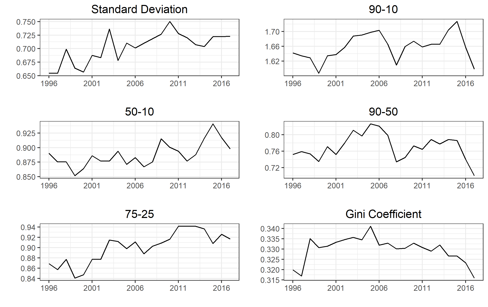

```{r setup, include=FALSE, cache = FALSE}
knitr::opts_chunk$set(echo = FALSE, cache = FALSE, warning = FALSE, message = FALSE)

```

\newcommand{\inputtable}[1]{
  \begingroup\setstretch{1.0}
  \input{#1}
  \endgroup
}

\newcommand{\lrangle}[1]{
  \langle #1 \rangle
}

\bigskip

\begin{center}
\begingroup\setstretch{1.0}\Huge
Is Technology Driving Wage Inequality in the United States?
\endgroup
\end{center}

\bigskip

\begingroup\Large\centering
Mu Yang Shin

Advisor: Professor Christopher Walters[^Advisor]

[^Advisor]: I would like to sincerely thank Professor Walters for his insights and guidance. Any error or mistake is my own.

\bigskip

\bigskip

\endgroup

\begin{center}
\begingroup\Large
\textbf{ABSTRACT}
\endgroup
\end{center}

\bigskip
\begingroup\setlength{\parindent}{0em}
This paper provides a descriptive account of how technological advances have impacted the United States wage inequality by focusing on high technology occupations. Although recent data indicate that the rise in the US wage inequality might have slowed  down, the rise of high technology occupations has been steady and concentrated in higher wage groups, both at the individual and industry level. By employing a distribution regression method to estimate counterfactual distributions, this paper provides evidence that technology has contributed to higher wage inequality both through wage structure and composition effects.
\endgroup


\newpage
# Introduction
<!-- (1) motivate your research question,  -->
<!-- (2) clearly state the question,  -->
<!-- (3) briefly outline how you will endeavor to answer the question,  -->
<!-- (4) present your key results, and  -->
<!-- (5) give a roadmap of the rest of the paper -->

<!-- Lit Review -->
<!-- What is known -->
<!-- What types of methods have people used -->

An enormous volume of literature has provided evidence of the rising income inequality in the United States over the decades. Although @piketty_distributional_2016 suggested that the rise of income inequality has mostly been a capital income phenomenon rather than a labor income phenomenon since 2000, labor income inequality is still important in studying income inequality since labor income constitutes about 70% of the national income. @juhn_wage_1993 documented an increase in male wage inequality between 1963 and 1989, and @piketty_distributional_2016 found that average pre-tax income per adult has stagnated for the bottom 50% income group since 1980 despite an economy-wide increase of 60%. Many studies have also suggested that higher education wage premium is one of the main reasons behind rising income inequality (@goldin_race_2007, @autor_computing_1998, @juhn_wage_1993).

Recent decades of the rising wage inequality have coincided with the rise of high technology industry.  @muro_americas_2015 provided evidence that wage premium at every level of education is higher among high technology industries than non-high technology industries. @galbraith_between-sector_2007 found that between-sector wage inequality between 1969 and 2006 showed a very similar trend to the conventional CPS-based household income inequality, and between-sector variations dominated between-state variations.

One of the theories proposed to study the relationship between inequality and technology is the Skill-Biased Technology Change hypothesis (SBTC). The hypothesis claims that technological changes biased toward skilled workers, such as computer-related technologies, increase the relative demand of highly skilled workers and thus cause their relative wages to rise. @autor_computing_1998 found that the rate of skill upgrading has been greater in more computer-intensive industries, using the fraction of workers who use a computer keyword as the measure of the spread of computer technology. @card_skill-biased_2002 used CPS data from the 1960s to 1990s to compare the predictions of SBTC and what have actually happened, concluding that SBTC fails to explain some key dimensions. Especially, the authors presented that the fall in the relative wages of computer science and engineering graduates in the 1990s is one of the interesting puzzles that SBTC cannot explain. @haskel_does_2002 found that technological changes were concentrated in skilled-labor-intensive sectors, creating a sector bias which in turn caused the changes in skill premium.

This paper takes a slightly different approach by focusing on wage gap between high technology occupations and the rest of workers. Among workers with a similar level of education, certain occupations utilize new technologies to a far greater degree than other occupations, and therefore are likely to have been affected more by technological advances. By dividing entire workforce into technology and non-technology workers, this paper aims to first provide a descriptive account of how wage inequality has been impacted by the recent rise of high technology industry, and then to empirically estimate the impact by constructing counterfactual distributions. 

Methods have been developed to decompose the difference in a distributional statistic since @oaxaca_male-female_1973 and @blinder_wage_1973, which decomposed changes in mean wages into wage structure and composition effects. @fortin_decomposition_2010 provides a comprehensive overview of decomposition methods. Recently, @chernozhukov_victor_inference_2013 developed modeling for counterfactual distributions based on regression methods. They introduced distribution regression (DR) method as a comprehensive tool to model and estimate the entire conditional distribution. Since this method enables comparisons not only of means but also of other distribution statistics, this paper employs DR to decompose changes in wage inequality between 1996 and 2017.

Using more recent data from  the Current Population Survey (CPS) Outgoing Rotation Group (ORG) data[^Github], this paper finds that the rise in the US wage inequality has at least slowed down, and some measures indicate a possibility that wage inequality has even started to  fall.  Despite the potential trend reversal, this paper finds that the rise of high technology industry has been steady and concentrated in higher wage groups, both at the individual and industry level between 1996 and 2017. At the individual level, both the share of technology workers and the wage gap between technology and non-technology workers have risen. When divided into wage groups, individuals beloging to the top 10% wage group showed a much higher growth in the share of technology workers than the middle 40% and bottom 50%. 

To identify the trend at the industry level, this paper takes an occupation-oriented approach to identify technology industries, using the share of technology workers as a measure of technology use in a sector. By combining industry wage data with occupation data from 2002, this paper finds that although technology use has become more prevalent, it is very unevenly distributed among industry sectors. Furthermore, sectors paying high wages and sectors paying low wages show noticeably different trends in technology use. While sectors which belong to the bottom 50% wage group stagnated in terms of the shares of technology workers (+0.10 percentage point), the top 10% group grew by 7.21 percentage point.

Using the distribution regression method introduced by @chernozhukov_victor_inference_2013, this paper estimates the impact of the rise of high technology industry on wage inequality both through wage structure and composition effects. This paper finds that although some of the changes in inequality measures are close to zero or negative, the contributions of technology are mostly greater than zero, suggesting that the rise of high technology occupations has worsened the US wage inequality during the period. The finding is robust to different definitions of technology occupations. Considering that technology will play an even more important role in the future, this finiding suggests that technological advances will likely to keep contributing to higher wage inequality. 

The paper is organized as follows. Section 2 documents the data sources used in this paper and demonstrates basic trends in wage inequality both at the individual and industry level. Section 3 discusses the estimation of counterfactual distribution using the distribution regression method from @chernozhukov_victor_inference_2013, and Section 4 presents the empirical results. Section 5 concludes.

[^Github]: Data and codes are available at https://github.com/muyangshin/Honors-thesis/.

\newpage

# Data Sources and Trends in Wage Inequality
## Individual-Level Trends
This paper uses data from the CPS Outgoing Rotation Group (ORG)[^IPUMS] from 1996 to 2017 to analyze the trends in wage inequality at the individual level. Compared to another widely-used data, the Annual Social and Economic Supplement (ASEC), the ORG file has a couple of advantages, as pointed out by @bernstein_has_1997. First, hourly wage does not need to be constructed from annual wage and salary as in the ACES. Second, the ORG is less likely to be affected by recall bias since respondents are asked about their previous week's earnings, instead of previous year's earnings.

[^IPUMS]: Data were obtained from the Integrated Public Use Microdata Series (IPUMS).

As in @dinardo_labor_1996, this paper restricts the sample to individuals of age 16 to 65 and hourly wage between \$1 to \$350 (in 2009 dollars). The GDP deflator for personal consumption expenditures is used to convert nominal wages into 2009 dollars[^deflator]. Observations are weighted by the product of the CPS sample weights (*ASECWT*) and usual hours of work to put more weight on workers who supply more hours to the labor market. Observations with allocated earnings are excluded from analysis; since the ORG did not identify imputed earnings obervations between January 1994 and August 1995, this paper uses data from 1996 to 2017.
<!-- TODO: Doesn't deal with top-coding -->

[^deflator]: Indices were retreived from the Federal Reserve Bank of St. Louis website (https://fred.stlouisfed.org/series/DPCERD3Q086SBEA).

<!-- TODO: Make observations, summary and inequality -->
Summary statistics by year and sex are reported in Table \ref{tab:tab_org_summary_men} and \ref{tab:tab_org_summary_women}, and inequality measures are reported in Table \ref{tab:tab_wage_ineq_measures_men} and \ref{tab:tab_wage_ineq_measures_women}. Figure \ref{fig:fig_ineq_measures_by_year} displays the trends in different inequality measures for men between 1996 and 2017. Trends in Gini coefficients suggest that the rise in wage inequality has not only slowed down since the 2000s as pointed out by @piketty_distributional_2016, but also started to fall since 2013. However, because the ORG's nominal topcode for weekly earnings has been constant at \$2,885 since 1998, there exists a potential downward bias due to inflation.

```{r fig_ineq_measures_by_year, fig.cap="\\label{fig:fig_ineq_measures_by_year}Inequality Measures, 1996-2017, Men"}

```

Figure \ref{fig:fig_cps_tech_trend} shows that wage gap between technology and non-technology workers has been rising and not slowed, unlike wage inequality in general. The left panel displays that the share of technology workers have been steadily rising, both among men and women. The right panel illustrates that the differences in average hourly wage between technology and non-technology occupations have been also rising. The differences are noisier for female workers, which is likely to be due to smaller number of female technology workers. Therefore, this paper narrows the scope of analysis to male workers. 

Figure \ref{fig:fig_cps_wage_group} displays the trends in wage and technology occupations across three wage groups: top 10%, middle 40%, and bottom 50%. The left panel shows that wage gap between the top 10% and bottom 50% has not widened since 2000, while the middle 40% has steadily gained; it again suggests that wage inequality has not worsened over the recent years. However, the right panel displays that there has been a drastic change in occupational composition especially in higher wage groups. Top 10% used to have a lower share of technology workers than middle 40% in the early 2000s, but the share has grown much faster among top 10% than middle 40%; now top 10% has a noticeably higher share than middle 40%. On the other hand, the bottom 50% has shown relatively little change.

```{r fig_cps_tech_trend, fig.cap="\\label{fig:fig_cps_tech_trend}Trends in Technology Occupations, CPS Data"}

```

```{r fig_cps_wage_group, fig.cap="\\label{fig:fig_cps_wage_group}Comparison between Wage Groups, CPS Data, Men"}

```

Figure \ref{fig:fig_cps_tech_educ_group} adds another dimension: education. The left panel shows that wage gap has widened not only between college-educated and non-college-educated non-technology workers, but also between college-educated technology and non-technology workers. The right panel shows that the fraction of college-educated, non-technology workers has been stable, while college-educated technology workers and non-college-educated, non-technology workers have showed opposite trends. The share of non-college-educated technology workers have been almost near zero, suggesting that most of technology workers are college-educated.

```{r fig_cps_tech_educ_group, fig.cap="\\label{fig:fig_cps_tech_educ_group}Comparison between Education and Technology Grouops, CPS Data, Men"}

```

## Industry-Level Trends
To further analyze the trends in wage and technology at the industry level, this paper links the occupational composition data from the Occupational Employment Statistics (OES) to the employment and earnings data of the Quarterly Census of Employment and Wages (QCEW). 

### OES
This paper uses occupational composition data from the OES to identify the trends in technological advances at a 4-digit NAICS code level. The OES is based on a semiannual survey, run by the Bureau of Labor Statistics (BLS), which covers about 200,000 establishments per panel. The OES reports employment data by Standard Occupational Classification (SOC)-coded occupation and NAICS-coded industry sector. Datasets are available from 1988, but the first dataset which reports at a 4-digit NAICS code level is the 2002 dataset.

Since technology is an ambiguous concept, this paper uses an occupation-oriented approach to measure the degree of technology use in an industry: the higher the share of technology workers is, the more an industry uses technology. With a given set of technology occupations, this approach produces a continuous measure of technology use which ranges from 0 to 1. Since the degrees to which industries utilize technology greatly differ even among so-called technology industries, this approach has an advantage of being able to compare sectors with high technology use, in contrast to dichotomous measures used in @hadlock_high_1991 or in @muro_americas_2015.

This paper's approach has a couple of advantages over the approach of @autor_computing_1998, which used the fraction of workers who directly use a computer keyboard as a measure of the spread of computer technology. First, their measure fails to take account of workers who primarily use sophisticated electronic devices which function without keyboards. Second, more importantly, many of workers who daily use keyboards nowadays are not technology workers. It might have been true that the majority of keyboard users were technology workers before the 1990s, but now computers and keyboards are an essential part of any workplace, not necessarily technology-related.

The effectiveness of the occupation-oriented approach relies on how well technology occupations are defined. The primary criterion used in this paper is based on "*high-tech* occupations" in @kilcoyne_high-tech_2001, which identifies technology occupations based on the level of technology utilization. High-tech occupations are defined as workers who "typically or necessarily utilize new technologies to perform their duties". To test the robustness, this paper uses three other criteria: another set of occupations suggested by @kilcoyne_high-tech_2001, "*technology group* occupations"; *STEM* and *STEM-related* occupations defined by the BLS. Table \ref{tab:tab_tech_occ} provides the comprehensive list.

### QCEW
To examine the trends in technological advances at the industry level, this paper uses earnings and employment data from the QCEW. The QCEW is based on administrative data from the quarterly state unemployment insurance tax records, supplemented by two other BLS surveys, the Annual Refiling Survey and the Multiple Worksite Report. Since the QCEW is census, the data cover more than 95 percent of total employment and are not subject to sampling error. The unit of observation is an establishment, but the publicly available datasets report employment and wage by year and region only at the industry level, using the NAICS from 1990. Wages in the QCEW are defined as total compensation paid, including stock options and bonuses. This paper uses annual wage and employment data at a 4-digit NAICS code level from 2002 to 2016 in the private sector, measured in 2009 dollar.

Table \ref{tab:tab_top_bottom_tech_ind} lists industry sectors which had the highest and lowest shares of technology workers in 2016. At the top of the list, we see sectors such as Computer Systems Design and Related Services (5415) and Software Publishers (5112), which include Microsoft, Intel, and Qualcomm. On the other hand, 19 sectors had zero share of technology workers: many belong to Transportation and Warehousing (48) and Accommodation and Food Services (72) categories, which include 1-800-Flowers, Yellow Cab and Coca-Coa Bottling.   A share of technology workers seems to be a reasonable measure of technology use. It is easy to see that technology use is heavily concentrated in a few sectors, and even among the top 10 technology sectors, the gap between the first and the tenth amounts to 0.288.

<!-- TABLE: High-tech and low-tech industry sectors -->
\inputtable{tex/top_bottom_tech_ind_manual.tex}

By linking the measure of technology use constructed from the OES, the QCEW data provide insight on how the wage trends have evolved with technological advances at the industry level. Figure \ref{fig:fig_industry_tech_wage_employment_share} illustrates the trends in employment and wage share of technology workers; we see a steady increase in both employment and wage share of technology workers. Wage share is imputed based on an assumption that technology and non-technology workers receive the same level of wage within a sector; since technology workers tend to receive higher wages, actual wage shares of technology workers are expected to be higher.

```{r fig_industry_tech_wage_employment_share, fig.cap="\\label{fig:fig_industry_tech_wage_employment_share}Wage and Employment Share of Technology Occupations, Industry Data"}
knitr::include_graphics("png/industry_tech_wage_employment_share.png")
```

<!-- TODO: wage share imputation note  -->

Breaking down industry sectors into the top 10%, middle 40%, and bottom 50% wage groups, one can see the evolution of technology use has not been evenly distrtibuted among sectors. The panels of Figure \ref{fig:fig_ind_wage_group} suggest that the growth in average wage and the share of technology workers has been noticeably different between wage groups. On average, sectors saw a 14.67% increase in wage, and 1.00 percentage point increase in the share of technology workers. However, while the bottom 50% stagnated in terms of technology, the top 10% had substantially higher growth of 7.21 percentage points. 

```{r fig_ind_wage_group, fig.cap="\\label{fig:fig_ind_wage_group}Comparison between Industry Wage Groups"}
knitr::include_graphics("png/industry_trends_by_year_group.png")
```

## Summary
Although wage inequality measures indicate that the rise of the US wage inequality has slowed down or even reversed, data suggest that the rise of high technology occupations has been steady and concentrated in higher wage groups, both at the individual and industry levels. Not only the wage gap between technology and non-technology workers has risen, but also the composition has changed toward more technology workers. This paper employs the DR method to estimate the impact of these changes on wage inequality, which is discussed in Section 3.

\newpage

# Estimation of Counterfactual Distribution using the Distribution Regression Method
To construct counterfactual distributions and perform wage decompositions, this paper uses a semiparametric distribution regression (DR) method as introduced in @chernozhukov_victor_inference_2013. More specifically, my analysis uses their Algorithm 1 for DR.

The proposed model is
$$F_{Y|X} (y|x) = \varLambda(P(x)' \beta(y)) \text{ for all } y \in \mathcal{Y}$$
where $Y$ is a varible of interest (wage), $X$ is a vector of individual characteristics, $\varLambda$ is a link function, $P(x)$ is a vector of transformation of $x$, and $\beta(\cdot)$ is an unknown function-valued parameter. The authors noted that with a sufficiently rich $P(x)$, the choice of the link function is not important. Therefore, this paper uses logistic as the link function.

As formalized in the paper, populations are labeled by $k \in \mathcal{K}$, and for each population $k$, there is a random vector $X_k$ of covariates and a random outcome variale $Y_k$. The outcome is only observable in populations $j \in \mathcal{J} \subset \mathcal{K}$. 

The estimator of each counterfactual distribution is obtained by the plug-in rule, integrating an estimated conditional distribution $\hat{F}_{Y_j | X_j}$ over the estimated covariate distribtution $\hat{F_{X_k}}$:
$$
\hat{F}_{Y \lrangle{j|k}} (y) = 
  \int_{\mathcal{X}_k} \hat{F}_{Y_j | X_j}(y | x) d \hat{F_{X_k}}(x), 
  \text{} y \in \mathcal{Y_j}, (j, k) \in \mathcal{JK}
$$

The estimator of covariate distribution $F_{X_k}$ is obtained using the empirical distribution function:
$$
\hat{F}_{X_k}(x) = 
  n_k^{-1} \sum_{i=1}^{n_k} 1\{ X_{ki} \leq x\}, 
  \text{ } k \in \mathcal{K}
$$

Then, to estimate the conditional distribution $F_{Y_{(j, j)} | X_j}$, distribution regression takes the form
$$
\hat{F}_{Y_{(j, j)} | X_j} (y|x) = 
  \varLambda(P(x)' \hat{\beta}_{(j, j)} (y)), 
  \text{ } (y, x) \in \mathcal{Y}_j \mathcal{X}_j, \text{ } j \in \mathcal{J}
$$
$$
  \hat{\beta}_{(j, j)} (y) = 
  \arg \max_{b \in \mathbb{R}^{d_p}} \sum_{i = 1}^{n_j} 
    [1 \{ Y_{ji} \leq y \} \ln [\varLambda(P(X_{ji})'b)] + 1 \{ Y_{ji} > y \} \ln [1 - \varLambda(P(X_{ji})'b)]]
$$
where $d_p = dim P(X_j)$.

To isolate a wage structure effect associated with one variable from others, this paper constructs an additional counterfactual distribution. Let $X_{ji} = (U_{ji}, C_{ji})$ where $U_{ji}$ denotes a technology occupation indicator and $C_{ji}$ denotes other worker characteristics. Likewise, $\hat{\beta}_{(k, j)} = (\beta^U_k, \beta^C_j)$. Then, an estimator of the conditional distribution $F_{Y_{(k, j)} | X_j}$ takes the form:
$$
\hat{F}_{Y_{(k, j)} | X_j} (y|x) = 
  \varLambda(P(x)' \hat{\beta}_{(k, j)} (y)), 
  \text{ } (y, x) \in \mathcal{Y}_j \mathcal{X}_j, \text{ } j, k \in \mathcal{J}
$$

# Decomposition Results
In this section, I apply the above-mentioned distribution regression method to analyze the evolution of the US wage distribution between 1996 and 2017, using the CPS ORG data as discussed in Section 2. The dependent variable is the hourly log wage in 2009 dollars. Closely following @dinardo_labor_1996 and @chernozhukov_victor_inference_2013, the regressors include years of schooling, a quartic term in experience, 5 education dummy variables interacted with 4 experience dummy variables, and indicators for union status, race, marital status, and part-time status. Since female technology workers are much fewer than male counterparts and thus have noisier data, this paper analyzes the data only for men.

Let $F_{Y \lrangle{(t, s)|(r, v)}}$ denote the counterfactual distribution of log wages $Y$ when the wage structure associated and unassociated with technology is as in year $t$ and $s$, respectively, the technology occupation U is distributed as in year $r$, and the other worker characteristics $C$ are distributed as in year $v$. Given the counterfactual distributions, we can decompose the observed change in the distribution of wages between 1996 (year 0) and 2017 (year 1) into wage structure and composition effects:
$$
F_{Y \lrangle{(1, 1)|(1, 1)}} - F_{Y \lrangle{(0, 0)|(0, 0)}} = 
  \underbrace{[F_{Y \lrangle{(1, 1)|(1, 1)}} - F_{Y \lrangle{(0, 0)|(1, 1)}}]}_\text{Wage Structure Effect} + 
  \underbrace{[F_{Y \lrangle{(0, 0)|(1, 1)}} - F_{Y \lrangle{(0, 0)|(0, 0)}}]}_\text{Composition Effect}
$$

Furthermore, wage structure and composition effects are further decomposed into technology related and unrelated:
$$
\underbrace{F_{Y \lrangle{(1, 1)|(1, 1)}} - F_{Y \lrangle{(0, 0)|(1, 1)}}}_\text{Wage Structure Effect} =
  \underbrace{[F_{Y \lrangle{(1, 1)|(1, 1)}} - F_{Y \lrangle{(0, 1)|(1, 1)}}]}_\text{Changes related to Technology} +
  \underbrace{[F_{Y \lrangle{(0, 1)|(1, 1)}} - F_{Y \lrangle{(0, 0)|(1, 1)}}]}_\text{Changes unrelated to Technology}
$$
$$
\underbrace{F_{Y \lrangle{(0, 0)|(1, 1)}} - F_{Y \lrangle{(0, 0)|(0, 0)}}}_\text{Composition Effect} =
  \underbrace{[F_{Y \lrangle{(0, 0)|(1, 1)}} - F_{Y \lrangle{(0, 0)|(0, 1)}}]}_\text{Changes related to Technology} +
  \underbrace{[F_{Y \lrangle{(0, 0)|(0, 1)}} - F_{Y \lrangle{(0, 0)|(0, 0)}}]}_\text{Changes unrelated to Technology}
$$

The counterfactual distribution of wages are estimated as follows:
$$
\begin{aligned}
  F_{Y \lrangle{(0, 0)|(1, 1)}} & = \int F_{Y_{(0, 0)} | X_1} (y | x) dF_{X_1}(x) \\
  F_{Y \lrangle{(0, 1)|(1, 1)}} & = \int F_{Y_{(0, 1)} | X_1} (y | x) dF_{X_1}(x) \\
  F_{Y \lrangle{(0, 0)|(0, 1)}} & = \int \int F_{Y_{(0, 0)} | X_1} (y | x) dF_{U_0 |C_0} (u|c) dF_{C_1}(c)
\end{aligned}
$$

The conditional distribution $F_{U_0 |C_0} (u|c), u \in \{0, 1 \}$ is estimated by logistic regression, and the covariate distributions $F_{X_1}$ and $F_{C_1}$ are estimated by the empirical distributions.

Table \ref{tab:tab_decompose_high_tech} presents the empirical results. Although some of the changes in wage inequality measures are close to zero or negative as seen in Section 2, both wage structure and composition effects associated with technology are mostly positive. The only exception is the 90-50 gap, where wage sturcture effect associated with technology is negative. To test the robustness, the same decomposition is performed using three other definitions of technology occupations, presented in Table \ref{tab:tab_decompose_tech_group}-\ref{tab:tab_decompose_stem_related}. Although there are differences in magnitude, the overall trends are similar, suggesting that the decomposition is robust to different definitions of technology occupations.

\inputtable{tex/decompose_high_tech_manual.tex}

Figure \ref{fig:fig_analysis} presents the decomposition of differences between observed distributions in 1996 and 2017. The first panel shows that the observed CDF in 2017 is lower than in 1996, indicating  The magnitude of wage structure effects is relatively small compared to that of composition effects. The contribution of technology to the difference is clearly positive both in wage structure and composition effects, suggesting that changes in wage structure and composition of technology occupations have contributed to rising wage inequality in the United States. 

```{r fig_analysis, fig.cap="\\label{fig:fig_analysis}Observed CDFs and Decomposition of Observed Differences"}

```

\newpage

# Conclusion
This paper first provides a descriptive account of how wage inequality has been impacted by the recent rise of high technology industry, and then to empirically estimate the impact using counterfactual distributions. Although inequality measures suggest that the rise in wage inequality might have slowed down or even reversed, the rise of high technology occupations has been steady and concentrated in higher wage groups, both at the individual and industry level. Decomposition of changes in inequality measures indicates that technology has contributed to higher wage inequality both through wage structure and composition effects.

This paper raises a number of issues for future research. Although this analysis demonstrates a possible relationship between wage inequality and technology, it fails to capture which characteristics of the labor force have driven the US wage inequality to the other direction. As seen in Figure \ref{fig:fig_analysis}, wage structure and composition effects that are not associated with technology are negative and substantially large in magnitude. 

Second, this paper mostly focused on high technology occupations, but it is likely that technological advances have had heterogeneous impacts on non-technology occupation workers. Specifically, occupations whose primary tasks are easily automated could have been affected more by technological advances. Further analysis would provide insight on how technological advances affect the labor market through automation.

\newpage

<!-- section numbering -->
\renewcommand{\thesection}{A}
\renewcommand{\thesubsection}{A\arabic{subsection}}

<!-- table numbering -->
\setcounter{table}{0}
\renewcommand{\thetable}{A\arabic{table}}

# Appendix
## CPS Data
<!-- FIG: CPS Summary Statistics -->
\inputtable{tex/org_summary_men_manual.tex}

\inputtable{tex/org_summary_women_manual.tex}

<!-- FIG: Wage inequality measure over time -->
\inputtable{tex/wage_ineq_measures_men_manual.tex}

\inputtable{tex/wage_ineq_measures_women_manual.tex}

\newpage
## Technology Occupations
To test the robustness, this paper uses three alternative sets of occupations. First, "*technology group* occupations" focuses relatively more on major occupation groups in which the use of technology is prevalent. Instead of specific occupations, this method uses four major occupation groups: Computer and Mathematical Occupations (15-0000), Architecture and Engineering Occupations (17-0000), Life, Physical, and Social Science Occupations (19-0000), Healthcare Practitioners and Technical Occupations (29-0000). Although some of the occupations included in these major groups might not directly make use of high technology, this method is expected to capture potential spillover effects of high-technology workers on other workers whose functions are closely related.

The other two sets of technology occupations are *STEM*(Science, Technology, Engineering, and Mathematics) and *STEM-related* occupations, as defined by the BLS. Loosely, *STEM* occupations are comparable to *high-tech* occupations, while *STEM-related* occupations correspond to *technology group* occupations.

\newpage

\inputtable{tex/tech_occ_manual.tex}

\inputtable{tex/decompose_tech_group_manual.tex}

\inputtable{tex/decompose_stem_manual.tex}

\inputtable{tex/decompose_stem_related_manual.tex}

\newpage

# Bibliography